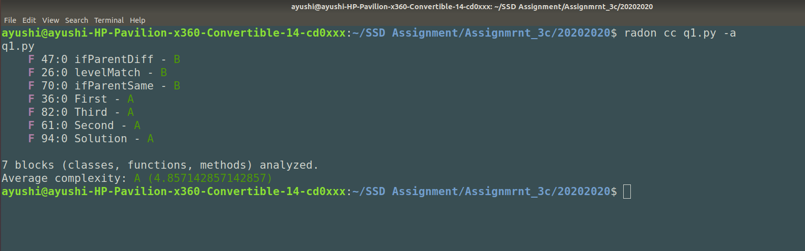
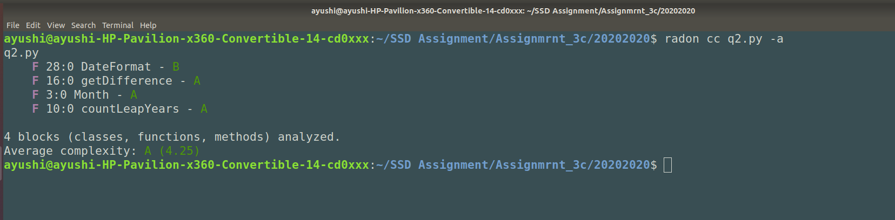
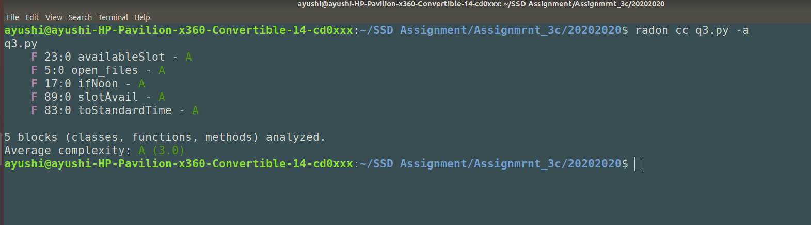

# ASSIGNMENT - 3c
## Question 1 -
- Changes from Part B:
    - In Part B, there were no functions used here in Part C I have split the same code into different functions.

## Question 2 -
- Changes from Part B:
No changes

## Question 3-
- Changes from Part B-
    -Reduced the code redundancy in `availableSlot` and `slotAvail` bu adding two new functions - `ifNoon` and `toStandardTime`.
     

    

## GitHub Repository - 
https://github.com/ayushipandey5/SSD_Assignment3
